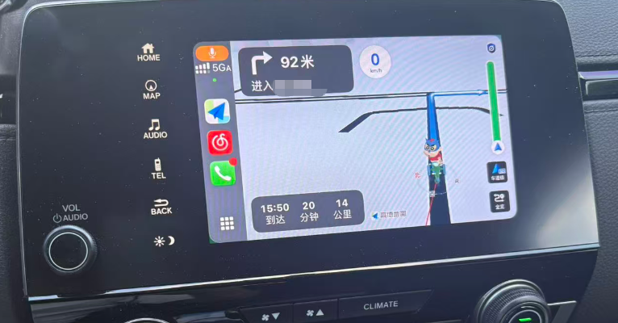

# CarPlay-CRV

[简体中文](#简体中文) | [English](#english)

## 简体中文

基于 [DiPlay](https://github.com/shihabal3amri/DiPlay) 开发，面向 **2021 款 Honda CR-V** 的 CarPlay 适配项目，优先实现有线连接。

**适配环境**
- 车机系统：Android **4.2.2 / API 17**（`minSdk=17`，不提高兼容基线）
- 包名：`com.shihab.diplay`
- 主要功能模块：USB、USBMUX、Lockdown、iAP2/MFi、CDC-NCM、AirPlay、音视频与触控

> **车机实测正常：** 2026-10-09 在 2021 款 CR-V 上，有线 CarPlay 正常连接，导航画面在车机上正常显示。音频、麦克风、触控和长时间稳定性仍需分别验证。当前默认 Auto 模式会尝试为拔线后的无线切换做准备；自动切换尚未完成实车验收。



*2026-10-09 车机实测：有线 CarPlay 导航显示正常。*

**构建与下载**

```bash
./gradlew :mobile:assembleDebug
```

APK 输出：`mobile/build/outputs/apk/debug/mobile-debug.apk`。也可从 [GitHub Actions](https://github.com/lylechencm-xh/CarPlay-CRV/actions/workflows/crv-2021.yml) 成功运行的 **Artifacts** 中下载。当前没有 GitHub Release 安装包；公开构建不包含 MFi 私钥或证书。

**测试反馈**

发生故障时，请保留 `carplay-crv-*.log`、APK 版本、iPhone/iOS 版本和故障现象。日志通常位于 `/sdcard/Android/data/com.shihab.diplay/files/`；分享前请脱敏。

详细说明：[代码导览](docs/CODEBASE-GUIDE.zh-CN.md) · [构建指南](docs/BUILD.md) · [实车测试清单](CRV-2021-TESTING.md)

> **免责声明：本项目仅供测试、学习与交流使用，请勿用于商业用途。**

---

## English

CarPlay adaptation project for the **2021 Honda CR-V**, based on [DiPlay](https://github.com/shihabal3amri/DiPlay), with wired CarPlay as the primary focus.

**Compatibility**
- Head unit: Android **4.2.2 / API 17** (`minSdk=17`; this baseline will not be raised)
- Package: `com.shihab.diplay`
- Main components: USB, USBMUX, Lockdown, iAP2/MFi, CDC-NCM, AirPlay, video, audio, and touch input

> **Vehicle test passed:** On 2026-10-09, wired CarPlay connected normally on a 2021 CR-V and displayed navigation on the head unit. Audio, microphone, touch input, and long-term stability still need separate verification. Auto mode now prepares Wi-Fi handoff when available; automatic switching still needs vehicle testing.


*2026-10-09 vehicle test: wired CarPlay navigation display working normally.*

**Build & Download**

```bash
./gradlew :mobile:assembleDebug
```

APK output: `mobile/build/outputs/apk/debug/mobile-debug.apk`. Alternatively, download the **Artifacts** from a successful [GitHub Actions](https://github.com/lylechencm-xh/CarPlay-CRV/actions/workflows/crv-2021.yml) run. No GitHub Release APK is currently available. Public builds do not include MFi private keys or certificates.

**Testing & Feedback**

If a connection fails, keep the `carplay-crv-*.log` file and note the APK version, iPhone/iOS version, and symptoms. Logs are typically under `/sdcard/Android/data/com.shihab.diplay/files/`. Remove sensitive data before sharing.

More details: [Codebase Guide (Chinese)](docs/CODEBASE-GUIDE.zh-CN.md) · [Build Guide](docs/BUILD.md) · [Vehicle Testing Checklist](CRV-2021-TESTING.md)

> **Disclaimer: For testing, learning, and educational exchange only. Not for commercial use.**

---

Based on [DiPlay](https://github.com/shihabal3amri/DiPlay). Original project and third-party license notices must be respected.
