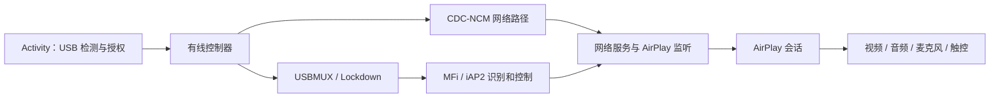

# CarPlay-CRV 代码导览

本文按 **2026-10-10 的本地源码** 整理，面向要阅读、定位和修改 2021 款 CR-V 适配代码的人。它描述代码职责与调用关系，不把“已实现”当作“已通过实车验收”。本地未提交的诊断和音频修改也包含在本次导览范围内。

## 1. 从哪里开始

| 想了解什么 | 先看哪里 |
| --- | --- |
| 车机应用如何启动、显示画面、取得 USB 权限 | [CrvCarPlayActivity.kt](../mobile/src/main/java/com/shilapi/xcertplay/CrvCarPlayActivity.kt) |
| 有线连接的主流程和重连 | [CrvWiredCarPlayController.kt](../mobile/src/main/java/com/shilapi/xcertplay/CrvWiredCarPlayController.kt) |
| iPhone USB、USBMUX、Lockdown、iAP2、CDC-NCM | [transport 目录](../shared/src/main/java/com/shilapi/xcertplay/transport/) |
| AirPlay 会话、音视频流和格式宣告 | [airplay 目录](../shared/src/main/java/com/shilapi/xcertplay/airplay/) |
| CR-V 上的实际音视频输出和麦克风 | [CrvApi19MediaSink.kt](../mobile/src/main/java/com/shilapi/xcertplay/CrvApi19MediaSink.kt)、[CrvApi19MicrophoneUplink.kt](../mobile/src/main/java/com/shilapi/xcertplay/CrvApi19MicrophoneUplink.kt) |
| 构建、签名与实车测试 | [构建指南](BUILD.md)、[实车测试清单](../CRV-2021-TESTING.md) |

## 2. 工程边界与目录

根目录的 [settings.gradle.kts](../settings.gradle.kts) 定义了当前 Gradle 构建：`:mobile`、`:shared`、`:crvlegacy`，以及独立的 `crv-simulator` included build。**车机 APK 的直接依赖是 `mobile → crvlegacy`**；`shared` 作为另一个模块存在，但 `mobile` 没有直接依赖它。

| 位置 | 作用与边界 |
| --- | --- |
| [mobile/](../mobile/) | Android 车机应用。`minSdk=17`、包名 `com.shihab.diplay`，包含界面、CR-V 专用控制器、媒体输出、诊断与 USB 相关 JNI。入口见 [AndroidManifest.xml](../mobile/src/main/AndroidManifest.xml)。 |
| [crvlegacy/](../crvlegacy/) | Android 4.2.2 兼容层。[build.gradle](../crvlegacy/build.gradle) 把 `shared/src/main/java` 作为源码目录，并排除部分依赖较新 Android API 的文件；因此“文件位于 shared”不代表它一定进入 CR-V APK。 |
| [shared/](../shared/) | 通用协议和媒体源码，也供其他构建使用。修改这里时要检查 `crvlegacy` 的排除清单及 API17 兼容性。 |
| [crv-simulator/](../crv-simulator/) | 独立的 Java 模拟器和回放测试；使用方法见其 [README](../crv-simulator/README.md)。它不是车机安装包。 |
| [automotive/](../automotive/)、[common/](../common/) | 仓库保留的其他平台代码，当前根构建没有包含这两个模块。 |
| [scripts/](../scripts/)、[.github/](../.github/) | 本地检查脚本和 CI 工作流。 |
| [docs/](./)、[site/](../site/) | 开发文档与网站源码。 |
| [21crvfiles/](../21crvfiles/)、[samples/](../samples/)、[release/](../release/) | 参考材料、样本与历史发布资料；判断当前行为应以源码、构建配置及对应实测日志为准。 |

## 3. 有线连接主链路



1. [CrvCarPlayActivity.kt](../mobile/src/main/java/com/shilapi/xcertplay/CrvCarPlayActivity.kt) 负责 USB 设备事件、权限、连接按钮、`TextureView`、触摸坐标和界面状态。它创建并持有有线控制器。
2. [CrvWiredCarPlayController.kt](../mobile/src/main/java/com/shilapi/xcertplay/CrvWiredCarPlayController.kt) 的 `runWired` 组织完整连接。它先准备 NCM，再建立 USBMUX/Lockdown 会话，并在认证前让 AirPlay 监听器就绪。CR-V 优先尝试 Honda 内核 CDC-NCM；内核路径失效且满足代码中的回退条件时，才使用用户态 [NcmUsbBridge.kt](../shared/src/main/java/com/shilapi/xcertplay/transport/NcmUsbBridge.kt)。
3. USB 与配对的主要实现位于 [IphoneUsbHost.kt](../shared/src/main/java/com/shilapi/xcertplay/transport/IphoneUsbHost.kt)、[Iap2UsbMuxHost.kt](../shared/src/main/java/com/shilapi/xcertplay/transport/Iap2UsbMuxHost.kt)、[LockdownPairingClient.kt](../shared/src/main/java/com/shilapi/xcertplay/transport/LockdownPairingClient.kt) 和 [LockdownCarKitClient.kt](../shared/src/main/java/com/shilapi/xcertplay/transport/LockdownCarKitClient.kt)。iAP2 识别及有线控制见 [Iap2IdentificationClient.kt](../shared/src/main/java/com/shilapi/xcertplay/transport/Iap2IdentificationClient.kt) 与 [Iap2WiredControlClient.kt](../shared/src/main/java/com/shilapi/xcertplay/transport/Iap2WiredControlClient.kt)。
4. [CrvMfiProvider.kt](../mobile/src/main/java/com/shilapi/xcertplay/CrvMfiProvider.kt) 选择可用认证来源；相关本地输入和 Honda 路径见 [CrvMfiAssets.kt](../mobile/src/main/java/com/shilapi/xcertplay/CrvMfiAssets.kt)、[CrvOemMfiAuthenticator.kt](../mobile/src/main/java/com/shilapi/xcertplay/CrvOemMfiAuthenticator.kt)。[CrvHondaMediaCoreMonitor.kt](../mobile/src/main/java/com/shilapi/xcertplay/CrvHondaMediaCoreMonitor.kt) 是被动观察器，不是认证服务。源码和公开构建不内置私钥。
5. [CarPlayVpnService.kt](../shared/src/main/java/com/shilapi/xcertplay/network/CarPlayVpnService.kt) 接入内核或用户态网络，绑定 AirPlay 监听器，并创建会话。[AirPlaySession.kt](../shared/src/main/java/com/shilapi/xcertplay/airplay/AirPlaySession.kt) 处理会话控制。这里的“VPN”是本地车机与 iPhone 链路服务，不代表外部网络代理。

默认模式为 **Auto（USB 优先）**。连接 USB 时同时准备车机热点和有线 AirPlay 监听；手机收到 Wi-Fi 配置后，拔线可保留无线监听并等待无线会话。重新插线会关闭旧控制器并重新建立有线连接。若热点或双地址监听不可用，控制器回退到纯有线。界面仍可选择纯有线或独立的 Wi-Fi 测试模式。这个切换流程还需实车验收。

## 4. 画面、声音、麦克风与触控

| 数据方向 | 关键实现 | 阅读重点 |
| --- | --- | --- |
| iPhone → 车机画面 | [ScreenStream.kt](../shared/src/main/java/com/shilapi/xcertplay/airplay/ScreenStream.kt) → [CarPlayMediaEngine.kt](../shared/src/main/java/com/shilapi/xcertplay/airplay/CarPlayMediaEngine.kt) → [CrvApi19MediaSink.kt](../mobile/src/main/java/com/shilapi/xcertplay/CrvApi19MediaSink.kt) | 接收视频、缓冲与恢复、`MediaCodec` 解码和 `Surface` 显示。 |
| iPhone → 车机声音 | [AudioStream.kt](../shared/src/main/java/com/shilapi/xcertplay/airplay/AudioStream.kt) → `CarPlayMediaEngine` → `CrvApi19MediaSink` | AirPlay 宣告与协商格式、解码、`AudioTrack`、音频焦点和输出路由。格式定义见 [AirPlayConfig.kt](../shared/src/main/java/com/shilapi/xcertplay/airplay/AirPlayConfig.kt) 与 [AirPlayInfoPlist.kt](../shared/src/main/java/com/shilapi/xcertplay/airplay/AirPlayInfoPlist.kt)。 |
| 车机 → iPhone 麦克风 | [CrvApi19MicrophoneUplink.kt](../mobile/src/main/java/com/shilapi/xcertplay/CrvApi19MicrophoneUplink.kt)、[MicrophonePacketizer.kt](../shared/src/main/java/com/shilapi/xcertplay/airplay/MicrophonePacketizer.kt) | 录音输入、数据打包与上行。 |
| 车机 → iPhone 触控 | `CrvCarPlayActivity` → [CrvTouchSlotState.kt](../mobile/src/main/java/com/shilapi/xcertplay/CrvTouchSlotState.kt) → `CrvWiredCarPlayController.sendTouches` → `AirPlaySession` | 触摸槽位、坐标归一化、会话 HID 事件。 |

CR-V 运行在 API17，媒体实现需要避开较新 Android API；`CrvApi19MediaSink` 的名字指它对 API19 以上能力做条件处理，不表示应用最低版本提高到 19。视频队列与堆积恢复还可看 [CrvVideoJobQueue.kt](../mobile/src/main/java/com/shilapi/xcertplay/CrvVideoJobQueue.kt) 和 [CrvVideoBacklogRecovery.kt](../mobile/src/main/java/com/shilapi/xcertplay/CrvVideoBacklogRecovery.kt)。

## 5. 状态、重连和资源清理

- [CrvCarPlayStateMachine.kt](../mobile/src/main/java/com/shilapi/xcertplay/CrvCarPlayStateMachine.kt) 管理连接生命周期；[CrvConnectionStage.kt](../mobile/src/main/java/com/shilapi/xcertplay/CrvConnectionStage.kt) 将具体阶段和超时映射为可读状态。
- [CrvCarPlayResources.kt](../mobile/src/main/java/com/shilapi/xcertplay/CrvCarPlayResources.kt) 汇总连接持有的资源；[CrvControllerRecovery.kt](../mobile/src/main/java/com/shilapi/xcertplay/CrvControllerRecovery.kt) 定义停止、错误和恢复决策。查“重连后有声音/无声音”时，要同时看会话结束与媒体释放路径。
- [CrvProtocolTrace.kt](../mobile/src/main/java/com/shilapi/xcertplay/CrvProtocolTrace.kt) 记录协议层进度，便于区分 USB、NCM、Lockdown、认证、AirPlay 各阶段问题。

## 6. 日志与问题定位

[CrvDiagnostics.kt](../mobile/src/main/java/com/shilapi/xcertplay/CrvDiagnostics.kt) 负责诊断输出，[CrvLogStorage.kt](../mobile/src/main/java/com/shilapi/xcertplay/CrvLogStorage.kt) 管理日志文件和容量。通常在应用专属外部目录 `/sdcard/Android/data/com.shihab.diplay/files/`；若不可用，会退到应用内部目录。导出日志前应移除设备标识、配对信息和认证材料。

| 现象 | 优先查的层 |
| --- | --- |
| 连接停在 USB 或配对 | `CrvCarPlayActivity`、`IphoneUsbHost`、`Iap2UsbMuxHost`、`LockdownPairingClient`，对照 `CrvProtocolTrace`。 |
| 已配对但无画面 | `CrvWiredCarPlayController` 的 NCM 和 AirPlay 监听、`AirPlaySession`、`ScreenStream`、`CrvApi19MediaSink`。 |
| 微信语音后声道或声音异常 | `AirPlayConfig` / `AirPlayInfoPlist` 的格式宣告、`AirPlaySession` 音频流切换、`CarPlayMediaEngine` 会话回调、`CrvApi19MediaSink` 的 `AudioTrack` 与焦点释放。记录问题前后协商格式、焦点、路由和实际播放声道。 |
| 来电时切到原车电话界面 | 同时记录应用 `onPause/onResume`、音频焦点与 Honda 原车蓝牙免提行为。当前应用没有控制原车电话界面前台切换的可靠接口；代码侧日志只能帮助确定切换时序，不能把该现象写成已禁止。 |
| 断开后无法重连 | `CrvCarPlayStateMachine`、`CrvControllerRecovery`、`CrvCarPlayResources` 及控制器 `close`。 |

2026-10-10 的实测反馈包含来电跳到原车电话、手机发送微信语音后车机音频声道异常。本地源码已增加相关连接与音频诊断/清理逻辑，但**尚无这些改动在车上复测通过的证据**。保存完整故障前后日志，比单独截取报错行更利于判断原因。

## 7. 构建与验证

环境要求和完整流程见 [BUILD.md](BUILD.md)。Windows PowerShell 在项目根目录可运行：

```powershell
python .github/scripts/check-crv-baseline.py
python .github/scripts/check-api17-java.py
python scripts/check_public_tree.py
.\gradlew.bat :shared:testDebugUnitTest :crvlegacy:assembleDebug
.\gradlew.bat :crvlegacy:lintDebug :mobile:lintDebug
.\gradlew.bat :mobile:assembleDebug
```

`assembleDebug` 会先运行 `mobile` 的单元测试。普通 `mobile-debug.apk` 不带 MFi 身份，只能用于编译、安装及认证前链路验证，**不能称为独立实车 CarPlay 验收包**。获得合法授权的身份文件后，按 [构建指南](BUILD.md) 用 `DIPLAY_AUTH_ASSETS_DIR` 与 `assembleStandaloneDebug` 构建；不要把密钥、证书或配对记录提交到仓库。

仓库测试主要位于 [mobile/src/test/](../mobile/src/test/)、[shared/src/test/](../shared/src/test/)、[crv-simulator/src/test/](../crv-simulator/src/test/)。单元测试和模拟器可检查协议与状态处理；真实车机的电话前台、音频路由、麦克风及持续稳定性仍需按 [实车测试清单](../CRV-2021-TESTING.md) 验证。

## 8. 修改代码时的路径速查

- USB 枚举或权限：先改 `mobile` Activity，再检查 `transport` 的 USB 主机实现。
- 配对或 MFi 失败：先核对控制器阶段、`Lockdown*` 和 `CrvMfiProvider`，不要用绕过认证的方式消除报错。
- AirPlay 格式协商：联动检查 `AirPlayConfig`、`AirPlayInfoPlist`、`AirPlaySession`、`CarPlayMediaEngine` 和 CR-V sink。
- CR-V 播放或触控：优先改 `mobile` 中的 CR-V 专用实现，确认 API17 可运行。
- 通用协议行为：修改 `shared` 后同时验证 `shared` 与 `crvlegacy`；某些通用文件被 `crvlegacy` 排除。
- 用户可见状态和重连：检查 Activity、状态机、阶段映射、恢复与资源清理，避免只改一处提示文字。
